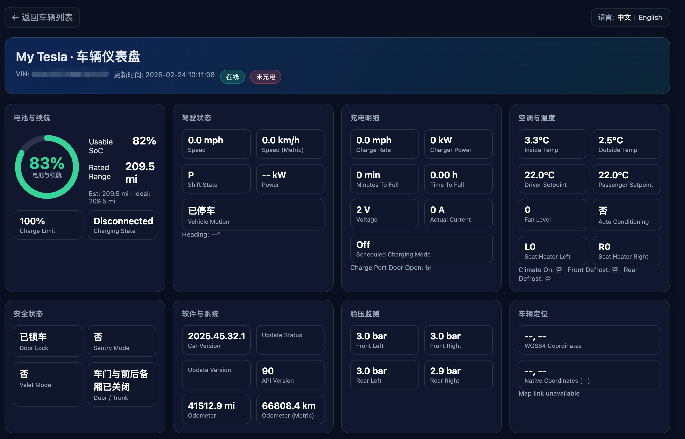
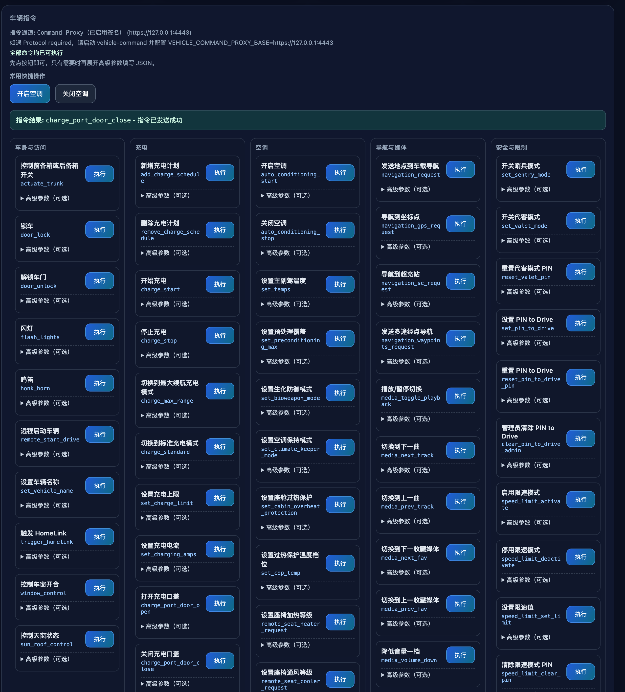
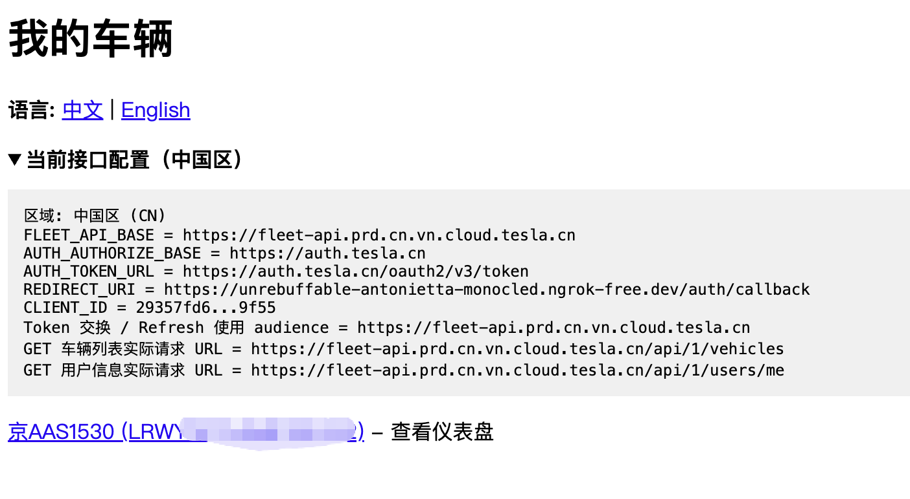
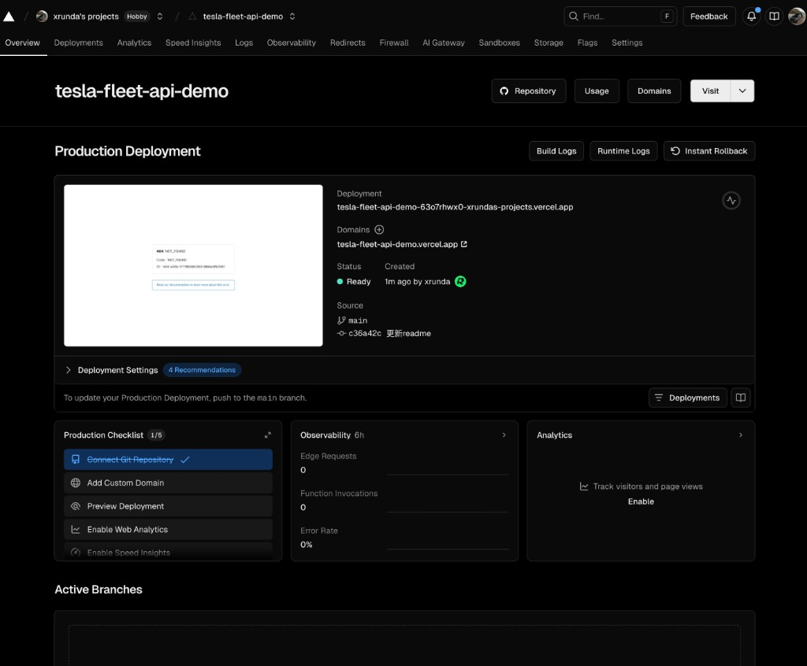

# Tesla Fleet API Demo（中国区）

这是一个基于 Flask 的 Tesla Fleet API 演示项目，已支持：

- OAuth 登录（中国区 `auth.tesla.cn`）
- 车辆列表与车辆详情可视化看板
- 中英文切换（`?lang=zh` / `?lang=en`）
- 车辆指令面板（全量命令入口）
- 可选 JSON 参数输入 + 一键填入示例
- Command Proxy 签名通道 + 自动 REST 回退（部分命令）



---

## 1. 当前能力概览

### 数据看板

- 电池/续航/充电状态
- 驾驶状态（速度、档位、功率）
- 空调与温度
- 安全状态（锁车、哨兵、代客）
- 胎压、里程、软件版本、定位
- 原始数据折叠查看

### 指令面板

- 所有已接入命令均可点击执行
- 每条命令有中文描述（命令名保留英文）
- 高级参数区支持可选 JSON
- 一键填入示例参数，降低输入成本

---

## 2. 目录结构

- `tesla_oauth_demo.py`：主程序（OAuth、车辆数据、指令执行、UI）
- `get_partner_token.sh`：注册 partner domain 脚本
- `.well-known/appspecific/com.tesla.3p.public-key.pem`：对外公钥
- `private-key.pem` / `public-key.pem`：本地密钥
- `imgs/`：README 配图

---

## 3. 前置要求

1. 中国区 Tesla 账号（`tesla.cn`）
2. 在 `developer.tesla.cn` 创建应用并拿到：
   - `CLIENT_ID`
   - `CLIENT_SECRET`
3. 安装 `ngrok`
4. Python 3.10+
5. （指令签名推荐）`vehicle-command` proxy

---

## 4. 配置应用

编辑 `tesla_oauth_demo.py` 顶部配置：

- `CLIENT_ID`
- `CLIENT_SECRET`
- `REDIRECT_URI`（必须与开发者后台一致）

中国区固定配置已内置：

- `FLEET_API_BASE = https://fleet-api.prd.cn.vn.cloud.tesla.cn`
- `AUTH_AUTHORIZE_BASE = https://auth.tesla.cn`
- `AUTH_TOKEN_URL = https://auth.tesla.cn/oauth2/v3/token`

---

## 5. 生成并发布公钥

```bash
cd "/Users/liguang/Documents/xRunda/project/AI/github/tesla-fleet-api-demo"

openssl ecparam -name prime256v1 -genkey -noout -out private-key.pem
openssl ec -in private-key.pem -pubout -out public-key.pem
mkdir -p .well-known/appspecific
cp public-key.pem .well-known/appspecific/com.tesla.3p.public-key.pem
```

---

## 6. 启动服务（基础数据能力）

### 6.1 启动 Flask

```bash
cd "/Users/liguang/Documents/xRunda/project/AI/github/tesla-fleet-api-demo"
python tesla_oauth_demo.py
```

### 6.2 启动 ngrok

```bash
ngrok http 8080
```

把 ngrok 域名填回：

- Tesla 开发者后台 `Allowed Origin` / `Redirect URI`
- 代码中的 `REDIRECT_URI`

### 6.3 注册 partner domain

```bash
cd "/Users/liguang/Documents/xRunda/project/AI/github/tesla-fleet-api-demo"
bash get_partner_token.sh
```

---

## 7. 指令签名（推荐）

对于大量新车型，车辆指令需要 Tesla Vehicle Command Protocol 签名。  
建议启动 `tesla-http-proxy` 后再执行命令。

### 7.1 启动 proxy（示例）

```bash
~/go/bin/tesla-http-proxy \
  -tls-key "/Users/liguang/Documents/xRunda/project/AI/github/tesla-fleet-api-demo/config/tls-key.pem" \
  -cert "/Users/liguang/Documents/xRunda/project/AI/github/tesla-fleet-api-demo/config/tls-cert.pem" \
  -key-file "/Users/liguang/Documents/xRunda/project/AI/github/tesla-fleet-api-demo/config/fleet-key.pem" \
  -host 127.0.0.1 \
  -port 4443
```

### 7.2 启动 Flask（连接 proxy）

```bash
cd "/Users/liguang/Documents/xRunda/project/AI/github/tesla-fleet-api-demo"
export VEHICLE_COMMAND_PROXY_BASE="https://127.0.0.1:4443"
export VEHICLE_COMMAND_PROXY_INSECURE="1"
python tesla_oauth_demo.py
```

---

## 8. 部署到 Vercel

项目已包含 Vercel 所需文件：

- `vercel.json`
- `api/index.py`
- `requirements.txt`

### 8.1 在 Vercel 设置环境变量

至少配置以下变量（Production / Preview 都建议配置）：

- `TESLA_CLIENT_ID`
- `TESLA_CLIENT_SECRET`
- `TESLA_REDIRECT_URI`（示例：`https://<你的-vercel-domain>/auth/callback`）
- `VEHICLE_COMMAND_PROXY_BASE`（可选；远程签名代理地址）
- `VEHICLE_COMMAND_PROXY_INSECURE`（可选；默认 `1` 仅用于开发）

### 8.2 部署后回填 Tesla 开发者后台

把 Vercel 域名回填到应用配置：

- Allowed Origin: `https://<你的-vercel-domain>`
- Redirect URI: `https://<你的-vercel-domain>/auth/callback`

并确保以下地址可公开访问：

- `https://<你的-vercel-domain>/.well-known/appspecific/com.tesla.3p.public-key.pem`

### 8.3 验证

- 打开 `https://<你的-vercel-domain>`
- 点击登录并完成授权
- 首页出现车辆列表
- 进入车辆详情页后测试“开启空调”等指令

---

## 9. 页面入口

- 首页：`https://<你的-ngrok-domain>`
- 车辆详情：点击车辆进入看板与指令面板
- 语言切换：
  - 中文：`?lang=zh`
  - 英文：`?lang=en`

---

## 10. 常见问题

### `Vehicle Command Protocol required`

- 含义：车辆要求签名命令
- 处理：启动 `vehicle-command` proxy，并设置 `VEHICLE_COMMAND_PROXY_BASE`

### `command requires using the REST API`

- 含义：该命令应走 REST API
- 当前代码：已支持自动回退尝试

### `JSON 参数格式错误，请检查 payload`

- 含义：高级参数里的 JSON 不合法
- 建议：先点“一键填入”再改字段

---

## 11. 配图

开发者后台配置示例：


当前项目 UI 示例：





