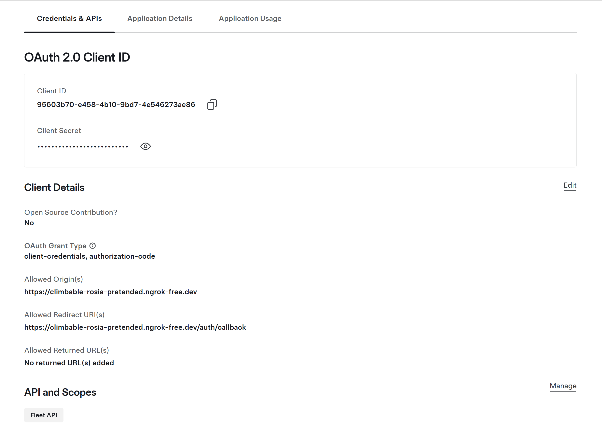
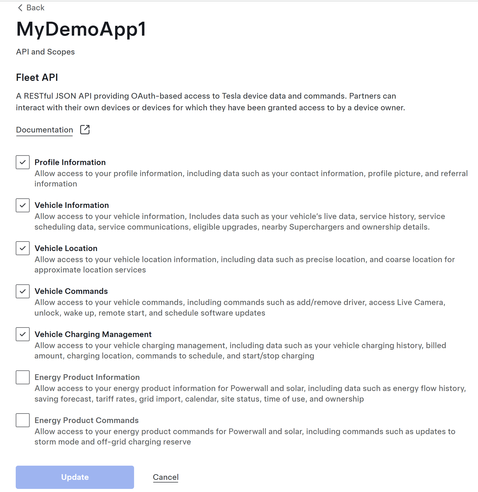

# Tesla Fleet API Demonstration

Quad Cities Tesla Guy and I built this repository to help you my viewers, and hopefully new subscribers to understand how to use the Tesla Fleet API similar to how I used it as part of the qcteslaguy.com  website.

This demo we will create an integration that lets you see your Tesla vehicle data from the official Tesla Fleet API, which could lead to other integrations in whatever way you can imagine. You could potentially get data from your vehicle, send commands like start climate, unlock/lock doors, set charging rates, similar to what you can do in Tessie or Home Assistant.

With the new official Tesla Fleet integration at your fingertips, you can now control core vehicle functions directly from your own websites, iphone apps, elgato stream deck, or anything else you can dream of. You can do far more than monitor your tesla if you want, you could allow a secure website integration or create a similar Stream Deck plugin that would give you the ability to control whatever features Tesla makes available through the core API's, which they expose and make available to owners and businesses.

In this guide, I’ll walk you through every step to get started.

- We will cover prerequisites
- Generate a Public/Private Key Pair
- Install NGROK as a temp solution for local development
- Access or Create a Tesla Account 
- Create a New Tesla Fleet API Application
- Testing our Fleet API with our Sample Python Web Application
- Installing our Key on the Vehicle for Future Command integration


## Prerequisites

1. Tesla Account with at least one vehicle or energy product
2. Tesla provides $10/month free API credit, but you must add a credit card for overages
3. A way to run curl commands against the tesla endpoints
4. A way to tunnel a secure (SSL) connection to your localhost runnig on port 8080, I used ngrok to setup my forwarding 

### Step 1: Generate a Public/Private Key Pair
From a terminal
```
openssl ecparam -name prime256v1 -genkey -noout -out private-key.pem
openssl ec -in private-key.pem -pubout -out public-key.pem
mkdir .well-known/appspecific
cp public-key.pem .well-known/appspecific/com.tesla.3p.public-key.pem
```

### Step 2: Install NGROK as a temp solution for local development

Go to [NGROK.com](https://ngrok.com/) and setup a free account.
Download and install the ngrok cli for your computer.
Run `ngrok http 8080` and expect output like the following:
```
�  One gateway for every AI model. Available in early access *now*: https://ngrok.com/r/ai                                                                                                                                                                                                                                                                                                     Session Status                online                                                                                                                                                            Account                       qcteslaguy@gmail.com (Plan: Free)                                                                                                                                 Version                       3.34.1                                                                                                                                                            Region                        United States (us)                                                                                                                                                Web Interface                 http://127.0.0.1:4040                                                                                                                                             Forwarding                    https://your-uinique-ngrok-name.ngrok-free.dev -> http://localhost:8080                                                                                                                                                                                                                                                                                         Connections                   ttl     opn     rt1     rt5     p50     p90                                                                                                                                                     0       0       0.00    0.00    0.00    0.00
```
The forwarding line will have a value like `https://your-uinique-ngrok-name.ngrok-free.dev -> http://localhost:8080`

The your-uinique-ngrok-name.ngrok-free.dev is the url you will need to access and setup the demo.

### Step 3: Access or Create a Tesla Account 

Go to [developer.tesla.com](https://developer.tesla.com) and login.

If you have a Tesla the owner has an tesla.com login. I also recommend setting up MFA if you have not done so yet.

If you don't have a Tesla buy one using my referal to save up to $1000 on a vehicle. However, this tutorial may not be for you if you don't have a Tesla Vehicle already.

[👉 Quad Cities Tesla Guy Refereal Link](https://ts.la/patrick360645)

### Step 5: Create a new Tesla Fleet API Application

1. **Go to**: https://developer.tesla.com/
2. **Sign in** with your Tesla account
3. **Create a new application**:
   - Application Name: "MyDemoApp"
   - Description: "A demo application"
   - Allowed Origin(s): `https://your-uinique-ngrok-name.ngrok-free.dev`
   - Redirect URI: `https://your-uinique-ngrok-name.ngrok-free.dev/auth/callback`
    
   - Scopes needed: Profile info, Vehicle: info, location, commands, charging management
     

### Step 5: Run Our Example Python Web Application

1. Replace the following values
```python
CLIENT_ID = "your-tesla-client-id"
CLIENT_SECRET = "your-tesla-client-secret"
REDIRECT_URI = "https://your-unique-ngrok-name.ngrok-free.dev"
```
2. Start the python app in a new termial `python tesla_oauth_demo.py`
3. Visit: [Our Local Application](https://your-uinique-ngrok-name.ngrok-free.dev) app will work in browser but not from the fleet api


#### Step 4: Register with partner used ngrok to create a public endpoint

Now that we have our python web application running and our ngrok public domain tunneling to our our locally running application we should be able to register our partner application.

Change the `AUDIENCE` value below to one of the following based on your location. For more information see the Fleet API Documentation.

- North America & Asia-Pacific (excluding China): `https://fleet-api.prd.na.vn.cloud.tesla.com`
- Europe, Middle East & Africa: `https://fleet-api.prd.eu.vn.cloud.tesla.com`
- China (中国大陆车辆): `https://fleet-api.prd.cn.vn.cloud.tesla.cn`

```
CLIENT_ID='your-tesla-client-id'
CLIENT_SECRET='your-tesla-client-secret'
AUDIENCE='https://fleet-api.prd.na.vn.cloud.tesla.com' 

response=$(curl --request POST --ssl-no-revoke \
  --header 'Content-Type: application/x-www-form-urlencoded' \
  --data-urlencode 'grant_type=client_credentials' \
  --data-urlencode "client_id=$CLIENT_ID" \
  --data-urlencode "client_secret=$CLIENT_SECRET" \
  --data-urlencode 'scope=openid vehicle_device_data' \
  --data-urlencode "audience=$AUDIENCE" \
  'https://fleet-auth.prd.vn.cloud.tesla.com/oauth2/v3/token')

ACCESS_TOKEN=$(echo $response | jq -r '.access_token')

curl --location "$AUDIENCE/api/1/partner_accounts" \
  --ssl-no-revoke \
  --header 'Content-Type: application/json' \
  --header "Authorization: Bearer $ACCESS_TOKEN" \
  --data '{
    "domain": "your-unique-ngrok-name.ngrok-free.dev"
}'
```

### Step 5: Install on your Vehicle

So far we have setup the ability to get vehicle data, but if you want to send commands in the future to your Tesla vehicle you will need to complete this last step, and install the private key in your vehicle to allow secure command communication.

Navigate to the tesla com site using the following link
https://tesla.com/_ak/your-unique-ngrok-name.ngrok-free.dev


